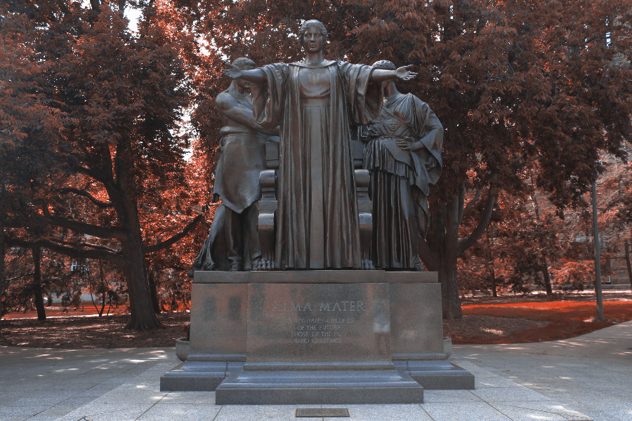

# Image-Transformation
A image transformation project using OOPs concept of cpp
To run it, Download all the files and change your desired image name to "alma.png" 
Then run the command
""make clean && make && ./main""
and its done

##Some sample images given below:

#ORIGINAL Image

#GRAYSCALE Image

#SPOTLIGHT Image

#Dichromatic Image

